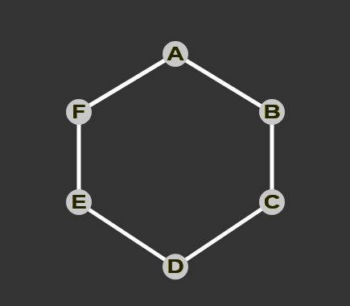
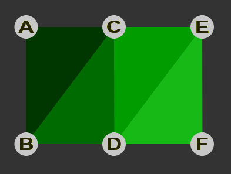

<slide data-background-opacity="0.5" data-background="./assets/definitions/22.png">
  ## Definitions

  Primitives
</slide>

<slide data-background="assets/rendered/scene0001.png"></slide>

<slide data-background="assets/rendered/scene0003.png"></slide>

<slide data-background="assets/rendered/vertex0003.png"></slide>

<slide data-background="assets/rendered/cube_vertices0003.png"></slide>

<slide data-transition="fade" data-background-opacity="0.75" data-background="assets/rendered/cube_vertices0003.png">
  ## Vertex

  Commonly called **point**... <!-- .element: class="fragment fade-up" -->
</slide>

<slide data-background-opacity="1" data-background="assets/rendered/cube_vertices0001.png">
  #### Position <!-- .element: class="fragment fade-up" -->

  #### Texture coordinate (UV) <!-- .element: class="fragment fade-up" -->

  #### Normal <!-- .element: class="fragment fade-up" -->

  #### Color <!-- .element: class="fragment fade-up" -->

  #### Index <!-- .element: class="fragment fade-up" -->

  #### etc... <!-- .element: class="fragment fade-up" -->
</slide>

<slide data-background-opacity="1" data-background="assets/rendered/cube_vertices0001.png">
  <pre>
    <code class="javascript" data-trim>/* Native WebGL */
GL.drawElements(GL.POINTS, ...)

/* THREE */
new Points(geometry, material)</code>
  </pre>
</slide>

<slide data-background="assets/rendered/edges0001.png"></slide>

<slide data-transition="fade" data-background-opacity="0.75" data-background="assets/rendered/cube_edges0003.png">
  ## Edge

  Commonly called **line**... <!-- .element: class="fragment fade-up" -->

  Composed of two vertices <!-- .element: class="fragment fade-up" -->
</slide>

<slide data-background-opacity="1" data-background="assets/rendered/cube_edges0001.png">
  

  <pre>
    <code class="javascript" data-trim>// Connect 2 by 2
GL.drawElements(GL.LINES, ...)</code>
  </pre>
</slide>
<slide data-background-opacity="1" data-background="assets/rendered/cube_edges0001.png">
  

  <pre>
    <code class="javascript" data-trim>// Connect all vertices (exclude first and last)
GL.drawElements(GL.LINE_STRIP, ...)</code>
  </pre>
</slide>

<slide data-background-opacity="1" data-background="assets/rendered/cube_edges0001.png">
  

  <pre>
    <code class="javascript" data-trim>// Connect all vertices (include first and last)
GL.drawElements(GL.LINE_LOOP, ...)</code>
  </pre>
</slide>

<slide data-background-opacity="1" data-background="assets/rendered/cube_edges0001.png">
  

  <pre>
    <code class="javascript" data-trim>// THREE
const mesh = new Line(...)</code>
  </pre>
</slide>

<slide data-background="assets/rendered/faces0001.png"></slide>

<slide data-transition="fade" data-background-opacity="0.75" data-background="assets/rendered/faces0001.png">
  ## Face

  Commonly called **triangle**... <!-- .element: class="fragment fade-up" -->

  Composed of three vertices <!-- .element: class="fragment fade-up" -->
</slide>

<slide data-background-opacity="1" data-background="assets/rendered/cube_faces0001.png">
  

  <pre>
    <code>// Draw by ollowing vertex order
GL.drawElements(GL.TRIANGLES, ...)</code>
  </pre>
</slide>

<slide data-background-opacity="1" data-background="assets/rendered/cube_faces0001.png">
  

  <pre>
    <code>// Draw by ollowing vertex order
GL.drawElements(GL.TRIANGLE_STRIP, ...)</code>
  </pre>
</slide>

<slide data-background-opacity="1" data-background="assets/rendered/cube_faces0001.png">
  

  <pre>
    <code>// Draw by ollowing vertex order
GL.drawElements(GL.TRIANGLE_FAN, ...)</code>
  </pre>
</slide>

<slide data-background-opacity="1" data-background="assets/rendered/cube_faces0001.png">
  
  <pre>
    <code>/* THREE */
const mesh = new Mesh(...)</code>
  </pre>
</slide>